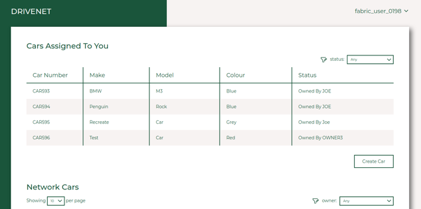

# DriveNet-App
 
<a id="top"></a>




## Introduction

DriveNet-App is a front-end application for *DriveNet*, a demonstration Hyperledger Fabric blockchain network that allows users to submit transactions that modify car records. It is based on the enhanced [fabcar smart contract](https://github.com/FabNetworks/fabcar-advanced).

---

## Using DriveNet-App

To see the DriveNet-App in action, it is usually simplest to join an instance of the DriveNet network using the registry at fabnetworks.org. Once you have joined the network, you will be given a URL for your DriveNet-App instance.

Log on to the DriveNet-App using credentials supplied to you as part of the joining process. Then you can use the UI to browse the ledger, and create, delete and modify car records.


---

## Installing DriveNet-App

In order to install and run DriveNet-App on [OCP](https://www.openshift.com/products/container-platform):

1. Run `git clone` to create a local copy of your repo.

2. Run `npm install` to install pre-requisites.

3. Log into your OCP cluster.

4. In the root of your repo, create a file called `.env` that is based on [.sample.env](.sample.env).

5. Modify the following values in the file: 

```
# JWT settings
SIGNING_SECRET="your secret"

# Wallet settings
HASH_SALT="your-salt"
```

where the values are random sequences of characters. The value of *SIGNING_SECRET* is used for signing tokens sent with API calls; *HASH_SALT* is used to produce hash-values for the application.

6. Save the file.

7. Create a new OCP project:

```
oc new-project drivenet
oc project drivenet
```

8. Create the credentials:

```
oc create secret generic drivenetcredentials --from-env-file .env
```

(To redeploy credentials in the future, run *oc delete secret drivenetcredentials* and then re-run the create command).

9. Deploy the DriveNet UI to your cluster:

```
npm run nodeshift
```

---

## Contact

If you have any questions or suggestions on the DriveNet-App, please contact blockchain@uk.ibm.com.


---
<sup>[_back to top_](#top)</sup>
